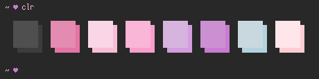

# clr: a color palette thingy

clr is a simple program to show off your color palette in your terminal. It's
written in C because I like C.



*Note: the sample above has a non-default configuration which includes black and
white. If you wish to achieve the same effect, see
[Configuration](#configuration).*

## Building

`make`

## Installing

`sudo make install`

## Configuration

By default, clr only shows the 6 "interesting" colors: red, green, yellow, blue,
magenta, and cyan. To change this, you can use the `CLR_OPT` environment
variable. Its value should be one of the following:

- a colon-separated list of numbers
- an empty string
- `ALL`
- `*`

If a colon-separated list of numbers is found, these set which colors are to be
displayed in the palette. The numbers are standard ANSI color values (0-7).

Example config:

```sh
# the following 3 will all show all 8 colors (as opposed to the default 6)
export CLR_OPT=ALL
export CLR_OPT='*'
export CLR_OPT=

# show only red, green, and blue
export CLR_OPT=1:2:4

# show only black and white
export CLR_OPT=0:7
```
